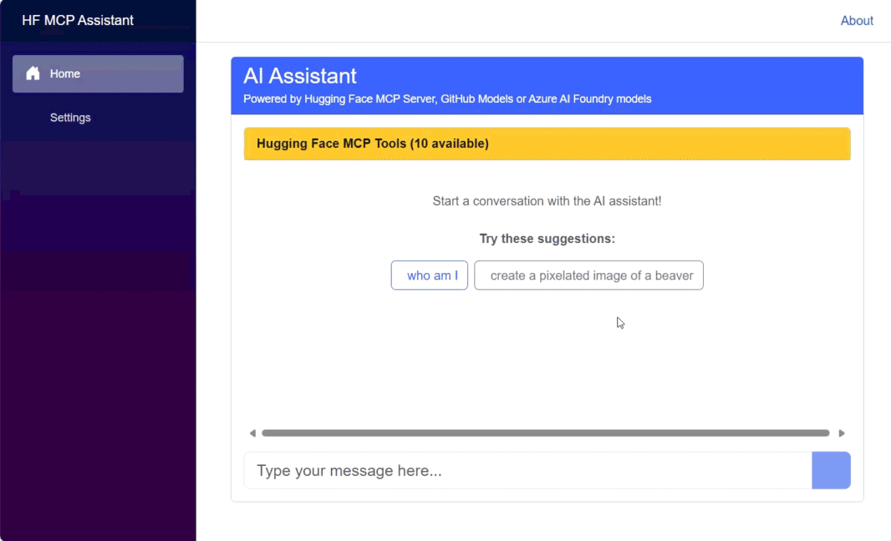

# HFMCP.GenImage: AI-Powered .NET Aspire Application

> **Note:** This solution was created using [this GenAI prompt](https://gist.github.com/elbruno/f9d592756bd0db8d9fe7b5f969f87a8d) and GitHub Copilot Agent Mode. It demonstrates how to build a modern .NET Aspire app with AI chat capabilities using the Hugging Face MCP Server.

**HFMCP.GenImage** is a .NET Aspire solution that brings AI-powered chat to your browser. The solution is designed for extensibility, security, and a great developer experience.



---

## Solution Structure

- **HFMCP.GenImage.AppHost**: Aspire orchestration project. Launches and manages the solution.
- **HFMCP.GenImage.ApiService**: API service that handles requests between the web UI and AI models.
- **HFMCP.GenImage.ServiceDefaults**: Shared configuration and service defaults for the solution.
- **HFMCP.GenImage.Web**: Blazor web application providing the AI chat interface and settings UI.

---

## Requirements

- [.NET 9.0 or newer](https://dotnet.microsoft.com/download/)
- GitHub Personal Access Token with Models API access
- [Hugging Face Access Token](https://huggingface.co/docs/mcp) (optional for image generation)
- Visual Studio 2022 or VS Code with C# extension

## Setup

### 1. Clone the repository

```bash
git clone <repository-url>
cd /05-AppCreatedWithGenAI/HFMCP.GenImage/HFMCP.GenImage.AppHost
```

### 2. Build the solution

```bash
dotnet restore
dotnet build
```

### 3. Run the application

```bash
dotnet run 
```

The Aspire dashboard and web application will be available at the URLs shown in the console output (e.g., `https://localhost:17147`).

### 4. Configure AI Services

1. Open the web application and go to the **Settings** page.
1. Enter your **Hugging Face Access Token**.
1. Enter your **GitHub Personal Access Token**.
1. Select your preferred AI model (default: gpt-4-1-mini).
1. Save the configuration.

#### Getting a GitHub Token

1. Go to [GitHub Personal Access Tokens](https://github.com/settings/personal-access-tokens/new)
2. Create a new token with Models API access
3. Copy the token and paste it in the Settings page

---

## Usage

**Chat Controls:**

- Type your message and press **Enter** to chat with the AI
- Go to **Settings** to change model or token
- All configuration is stored securely

**Supported Models:**

- GPT-4.1-mini (recommended)
- Llama 3.2
- Any model available that supports function calling

You can switch models at any time from the Settings page.
